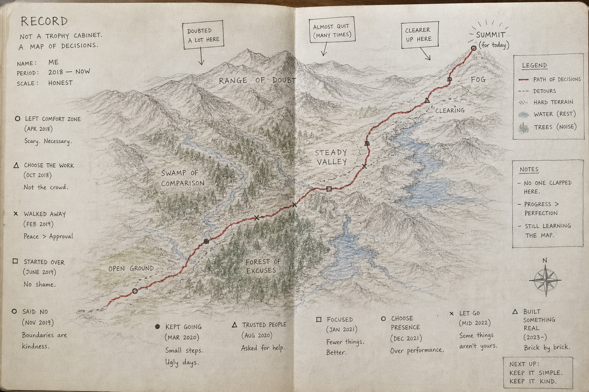

# Chris Nesbitt-Smith

Titles are a poor map. "Senior gov-tech architect" tells you where someone would like to stand, not what they can actually see, or have moved. Here is the terrain instead: a handful of decisions, most of them made with other people, some expensive, all still checkable.

A decision I am proudest of is a thing I argued should stop. At the Home Office I built the evidence base that let a senior responsible owner close a failing data-sharing programme, the Common Data Platform, then I ran the wind-down.

The rest is building, and it is teamwork, so I will say so. On the Bank of England's RTGS Renewal, the system that settles UK bank payments, I was one of several technical leads; I specified the platform architecture on [Kubernetes](https://kubernetes.io), the software that runs modern cloud services, and wrote the technical specification. At the Crown Prosecution Service I was hands-on in the team that architected and built the casework app prosecutors use to run a case, which frees more than 112,000 hours a year; the team won DevOps Project of the Year 2024, and the code is now [open](https://github.com/CPS-Innovation). At GDS I built NDX, the National Digital Exchange, to make cloud easier for the public sector to try and to buy, and its sandbox arm NDX:Try, NCSC engaged on the security architecture. NDX was [announced from No 10](https://www.gov.uk/government/news/one-stop-shop-for-tech-could-save-taxpayers-12-billion-and-overhaul-how-government-buys-digital-tools) and [switched off on 30 June 2026](https://www.linkedin.com/pulse/ndx-being-switched-off-problem-built-chris-nesbitt-smith-tz5ce/). Building a thing and staying answerable for it are different jobs; I still answer for systems I can no longer change.

Some of the work outlasts its programme: a cross-government open-source [leaderboard running nightly since 2018](https://www.linkedin.com/pulse/twenty-four-thousand-reasons-code-open-chris-nesbitt-smith-tn5me/). I am the most active external contributor to AWS Solutions' open-source [Innovation Sandbox](https://github.com/aws-solutions/innovation-sandbox-on-aws), where I reported a cross-tenant data-leakage flaw and a [JWT signature-verification](https://jwt.io/introduction) issue.

I teach what I claim: Kubernetes with Learnk8s since 2018, a [Linux Foundation zero-trust course](https://training.linuxfoundation.org/training/zero-trust-security-with-spiffe-and-spire-lfs482/) with Control Plane, 50-plus [service assessments](https://www.gov.uk/service-manual/service-assessments) as a GDS Technical Assessor, advice to other governments, and 70-plus talks, each backed by production code, not a slide. I still write more of the code than the title suggests (the [pink](https://www.linkedin.com/pulse/why-pink-chris-nesbitt-smith-nuxfe/) is deliberate). A record is a map of decisions, not a trophy cabinet.

Bring me a decision you are weighing; we will look at the board together. Outside IR35, London-based, hybrid.

## On the record

What others have written, in their own words, on LinkedIn.

> I worked alongside Chris at CPS where he laid the foundations for their legacy transformation programme. He put a stop to a failing approach, architected a new approach and shipped the first product using that approach, the casework tool that returns 112,000+ prosecutor hours a year to the frontline (Team DevOps Project of the Year 2024). Across both, he's the rare operator who briefs non-technical senior leaders (including ministers) in the morning and merges a PR in the afternoon. If you're running a regulated-scale platform problem in banking, CNI or government, and you actually want it to deliver, hire Chris.
>
> - **Chris Hesketh**, Senior Enterprise Architect for the Public Sector. *April 2026.*

> I will be honest, I joined the project with an open mind but also with a high level of skepticism. Chris met my scrutiny with impressive poise and intellectual honesty. He possessed the humility to adapt where my challenges held weight, yet maintained his conviction and held his ground where his vision was sound. I would work with him again in a heartbeat, and I would urge any organisation to secure his expertise.
>
> - **Joanne Newman**, IT Commercial Director. *April 2026, senior to Chris but not direct line.*

> Chris is a hard-working, diligent, and exemplary generalising specialist, equally at home leading or delivering complex, regulated systems. I've worked both alongside him, and contracted him numerous times, and would not hesitate to do so again.
>
> - **Andrew Martin**, CEO, ControlPlane. *April 2026, managed Chris directly.*

## Find me

- Writing: [blog.cns.me](https://blog.cns.me)
- Talks: [talks.cns.me](https://talks.cns.me)
- Profile and CV: [cns.me](https://cns.me)
- LinkedIn: [cnesbittsmith](https://www.linkedin.com/in/cnesbittsmith)
- Open-source leaderboard: [xgov-opensource-repo-scraper](https://www.uk-x-gov-software-community.org.uk/xgov-opensource-repo-scraper/)
